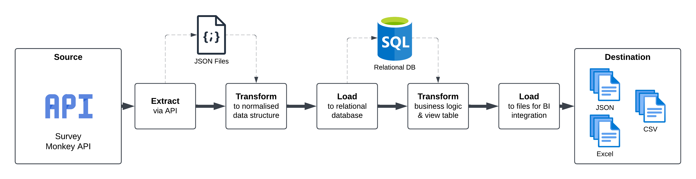
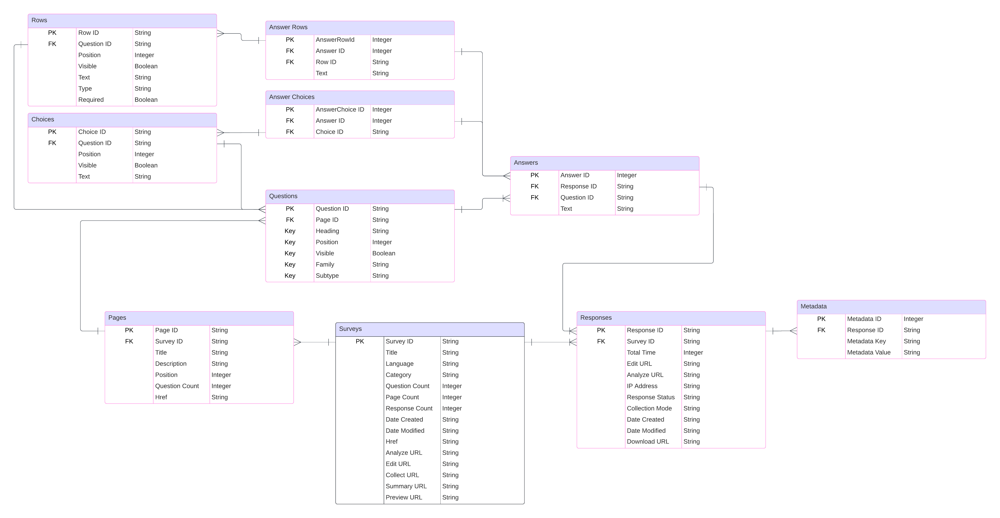

# Survey Monkey ETL Pipeline

This pipeline is used to extract survey data from the Survey Monkey API. It uses the following phases:



- Extract data from Survey Monkey API, staging in JSON files
- Normalize the data, storing it in a relational database
- Create a denormalzed summary table including additional transformations
    - Add additional column transform dates of birth into ages
    - Extract follower count from text, adding together into a new derived column  
- Save final output into CSV, JSON and Excel formats

## Prerequisites
- Python >=3.12
- PostgreSQL 17
- Survey Monkey API endpoint and access token with the following scopes:
    - View Surveys
    - View Responses
    - View Collectors
    - View Response Details

## Quick start
1. Clone this repository to your local system
2. _(Optional)_ Create a virtual environment using `python -m venv survey-monkey-pipeline`, starting it with `source /survey-monkey-pipeline/bin/activate`
3. Install project dependencies using `pip install -r requirements.txt`
4. Set your enviriables
5. Set `surveyId` in `/main.py`
6. Run `python src/main.py` (or use the included Jupyter Notebook)

## Environment variables
The following can be used to start your `.env` file containing credentials both for Survey Monkey and your database.
```
# Survey Monkey API Credentials
SURVEY_MONKEY_API_BASE=
SURVEY_MONKEY_API_KEY=

# Database Credentials
POSTGRES_USERNAME= 
POSTGRES_PASSWORD= 
POSTGRES_DATABASE= 
POSTGRES_HOST= 
POSTGRES_PORT= 
```

## Database schema
